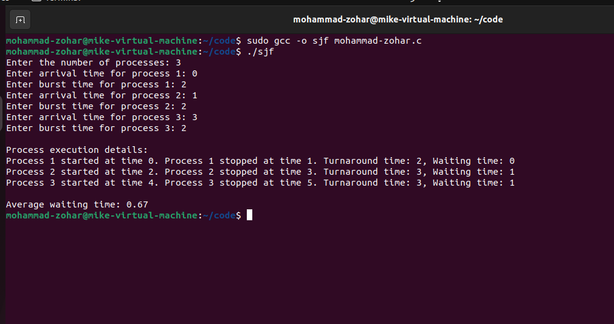

# MOHAMMAD ZOHAR ALI - محمد زهير علي


# Code Execution: 





# The Code: 

```
#include <stdio.h>
#include <stdlib.h>

#define MAX_PROCESSES 100

struct Process {
    int pid;    // process ID
    int arrival_time;
    int burst_time;
    int remaining_time;
};

int compare_arrival_time(const void *a, const void *b) {
    struct Process *p1 = (struct Process *)a;
    struct Process *p2 = (struct Process *)b;

    return p1->arrival_time - p2->arrival_time;
}

int main() {
    struct Process processes[MAX_PROCESSES];
    int n, time = 0, completed = 0, current_process = -1;
    int waiting_time = 0, turnaround_time = 0;
    float average_waiting_time, average_turnaround_time;

    printf("Enter the number of processes: ");
    scanf("%d", &n);

    // Input process details
    for (int i = 0; i < n; i++) {
        printf("Enter arrival time for process %d: ", i + 1);
        scanf("%d", &processes[i].arrival_time);
        printf("Enter burst time for process %d: ", i + 1);
        scanf("%d", &processes[i].burst_time);
        
        processes[i].pid = i + 1;
        processes[i].remaining_time = processes[i].burst_time;
    }

    // Sort the processes based on their arrival time
    qsort(processes, n, sizeof(struct Process), compare_arrival_time);

    printf("\nProcess execution details:\n");

    // Execute the processes
    while (completed < n) {
        int next_process = -1;
        int shortest_time = 999999;

        // Find the process with the shortest remaining time
        for (int i = 0; i < n; i++) {
            if (processes[i].arrival_time <= time && processes[i].remaining_time < shortest_time && processes[i].remaining_time > 0) {
                shortest_time = processes[i].remaining_time;
                next_process = i;
            }
        }

        if (next_process == -1) {
            time++;
            continue;
        }

        if (current_process != next_process) {
            printf("Process %d started at time %d. ", processes[next_process].pid, time);
        }

        processes[next_process].remaining_time--;

        if (processes[next_process].remaining_time == 0) {
            completed++;

            int turnaround = time - processes[next_process].arrival_time + 1;
            int waiting = turnaround - processes[next_process].burst_time;

            turnaround_time += turnaround;
            waiting_time += waiting;

            printf("Process %d stopped at time %d. Turnaround time: %d, Waiting time: %d\n", processes[next_process].pid, time, turnaround, waiting);
        }

        current_process = next_process;
        time++;
    }

    // Calculate the average waiting time and turnaround time
    average_waiting_time = (float)waiting_time / n;
    average_turnaround_time = (float)turnaround_time / n;

    printf("\nAverage waiting time: %.2f", average_waiting_time);
    printf("\nAverage turnaround time: %.2f", average_turnaround_time);

    return 0;
}
```


